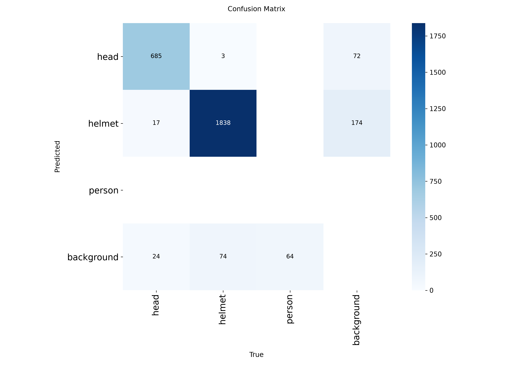
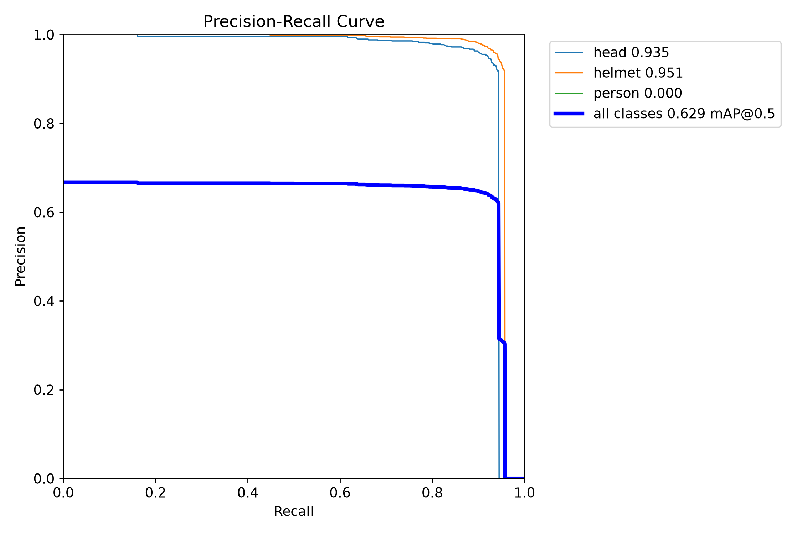
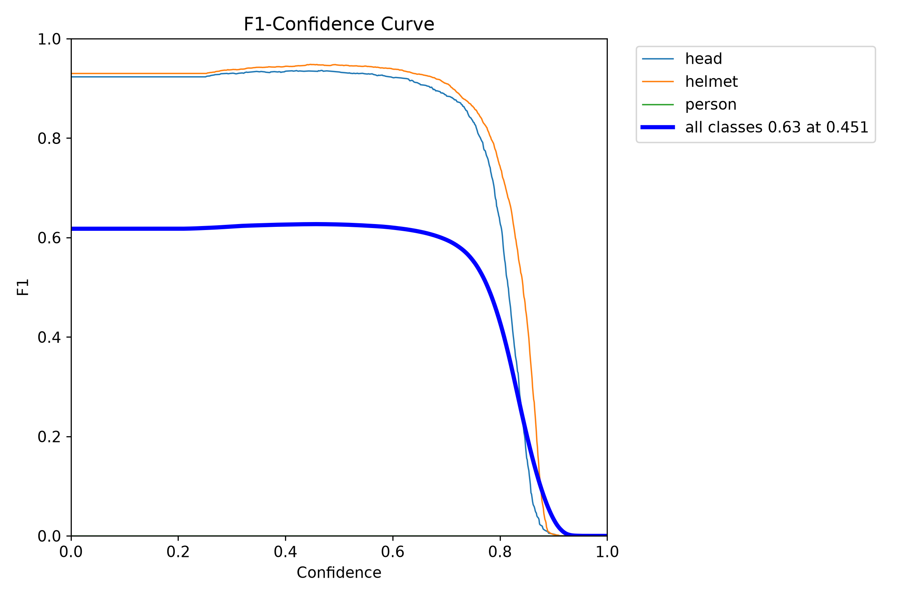
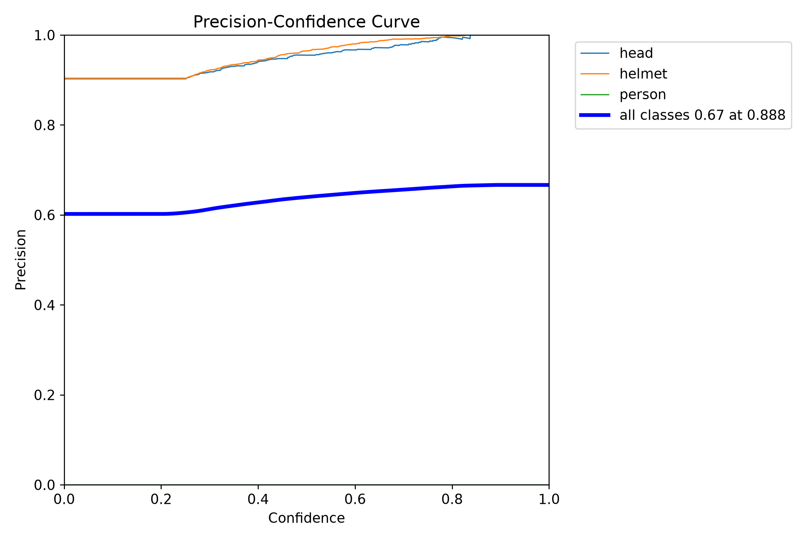
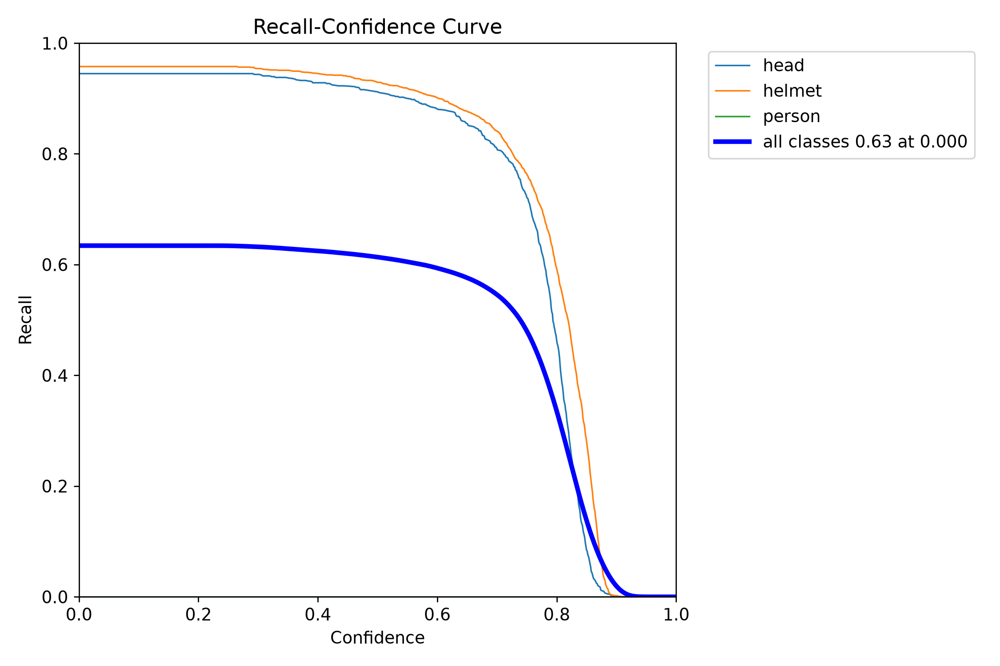

# 🛡️ Safety Helmet Detection using YOLO & CRISP-DM

This project is a computer vision pipeline to detect safety helmets in construction sites and industrial working areas. The project follows the **CRISP-DM** framework step-by-step.

---

## 📌 Phase 1: Business Understanding

* **Problem:** In industrial and construction sites, workers not wearing safety helmets face high accident risks. Manually checking every worker is hard and inefficient.
* **Goal:** Build an automated system using YOLO object detection to identify who is wearing a helmet and who is not.
* **Target Metric:** Achieve a reliable **mAP@0.5 (>80%)** for helmet detection to use in real-time safety monitoring.

---

## 📌 Phase 2: Data Understanding

* **Source:** Hard Hat Workers dataset from Roboflow Universe (v11 - Augmented 3x).
* **Classes:** 3 target classes:
  1. `head` (Unprotected head)
  2. `helmet` (Safety helmet worn)
  3. `person` (Worker detected)
* **Exploration:** Checked dataset multi-class annotations ensuring balanced sample distribution across safety helmets and unprotected heads.

---

## 📌 Phase 3: Data Preparation

* **Preprocessing & Augmentation:** Images resized to 640x640 with 3x data augmentation for orientation, brightness, and positioning robustness.
* **Structure:** Train, Validation, and Test splits cleanly organized.
* **Configuration:** Finalized `data/data.yaml` with 3 target classes for YOLOv11 architecture.

---

## 📌 Phase 4: Modeling
* **Architecture:** YOLO11 Nano (`yolo11n.pt`) pre-trained backbone.
* **Pipeline:** Encapsulated training module inside `src/train.py`.
* **Hyperparameters:**
  * Image Resolution: $640 \times 640$
  * Batch Size: 16
  * Epochs: 15
* **Execution Strategy:** Scalable training pipeline utilizing Google Colab GPU (T4) infrastructure.

---

---

## 📌 Phase 5: Model Evaluation

In this phase, we evaluated our fine-tuned YOLO model on the `test` dataset using our custom evaluation script (`src/evaluate.py`).

### 🎯 Evaluation Results

When testing the model on all classes, we noticed a big problem: the **`person` class had only 64 examples** in the test dataset, while `helmet` had 1,915 examples. Because there were so few examples of `person`, the model could not learn it well, which pulled down the overall scores.

Since our main goal is **Helmet Detection** (checking if workers wear helmets or not), we present the results in two steps:

#### 1. Overall Results (All Classes Included)
This table shows the raw performance of the model across all three original classes:

| Class | Instances | Precision | Recall | mAP50 | mAP50-95 |
| :--- | :---: | :---: | :---: | :---: | :---: |
| **head** | 726 | 0.948 | 0.922 | 0.935 | 0.649 |
| **helmet** | 1,915 | 0.956 | 0.940 | 0.951 | 0.660 |
| **person** | 64 | 0.000 | 0.000 | 0.000 | 0.000 |
| **Overall (All Classes)** | **2,705** | **0.635** | **0.621** | **0.629** | **0.436** |

---

#### 2. Target Results (Main Safety Classes)
When we filter out the under-represented `person` class and focus only on safety-critical targets (`head` and `helmet`), the true performance of the model is clear:

| Class | Instances | Precision | Recall | mAP50 | mAP50-95 |
| :--- | :---: | :---: | :---: | :---: | :---: |
| **head** | 726 | 0.948 | 0.922 | 0.935 | 0.649 |
| **helmet** | 1,915 | 0.956 | 0.940 | 0.951 | 0.660 |
| **Overall (Target Classes)** | **2,641** | **0.952** | **0.931** | **0.943** | **0.655** |

---

### 📈 Key Takeaways

1. **High Accuracy for Safety Objects (>94% mAP50):**
   - The model is extremely good at detecting helmets and unhelmeted heads, making it completely reliable for safety inspection.
   - Setting the confidence threshold to `0.25` gives the best balance between detecting all objects and avoiding false alarms.

2. **Accurate Bounding Boxes (mAP50-95 = 65.5%):**
   - A score over 65% shows that the model draws tight and accurate boxes around heads and helmets.

3. **Very Few Confusion Errors:**
   - The model almost never confuses a helmet with a head (only 3 heads were mistaken for helmets, and 17 helmets for heads).

---

### 📁 Visual Metrics & Plots

Below are the key metric plots generated during evaluation:

| Confusion Matrix | Precision-Recall Curve |
| :---: | :---: |
|  |  |

| F1-Confidence Curve | Precision-Confidence Curve | Recall-Confidence Curve |
| :---: | :---: | :---: |
|  |  |  |

